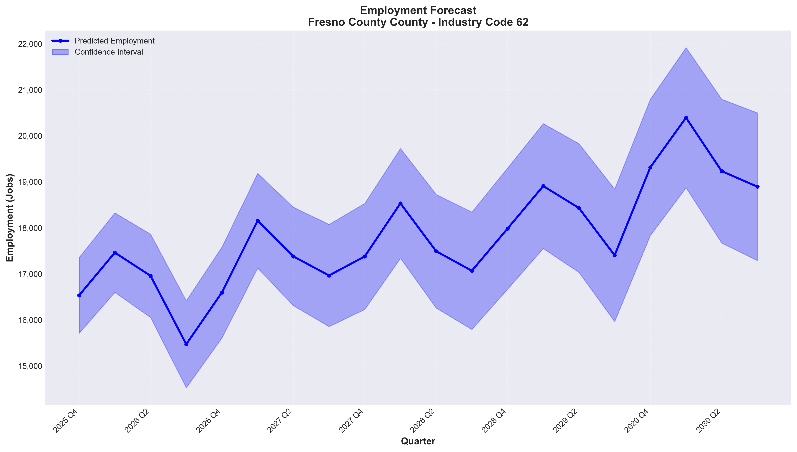

# Employment Forecast Report

**Generated:** 2025-11-28 14:56:42

## Forecast Parameters

- **Location:** Fresno County County, California
- **Industry Code:** 62
- **Forecast Horizon:** 20 quarters (5 years)
- **Target Period:** 2030 Q4

## Summary

- **Predicted Employment:** 18,893 jobs
- **Confidence Interval:** 17,288 - 20,498 jobs
- **Overall Trend:** Growing
- **Total Change:** +14.3%

## Quarterly Projections

| Quarter | Predicted Employment | Confidence Interval (Low - High) |
|---------|---------------------|----------------------------------|
| 2025 Q4 | 16,531 | 15,707 - 17,354 |
| 2026 Q1 | 17,460 | 16,595 - 18,324 |
| 2026 Q2 | 16,955 | 16,050 - 17,861 |
| 2026 Q3 | 15,467 | 14,520 - 16,413 |
| 2026 Q4 | 16,594 | 15,606 - 17,582 |
| 2027 Q1 | 18,153 | 17,124 - 19,182 |
| 2027 Q2 | 17,377 | 16,307 - 18,447 |
| 2027 Q3 | 16,962 | 15,851 - 18,073 |
| 2027 Q4 | 17,377 | 16,225 - 18,530 |
| 2028 Q1 | 18,531 | 17,337 - 19,724 |
| 2028 Q2 | 17,490 | 16,255 - 18,725 |
| 2028 Q3 | 17,065 | 15,789 - 18,341 |
| 2028 Q4 | 17,981 | 16,664 - 19,298 |
| 2029 Q1 | 18,907 | 17,548 - 20,265 |
| 2029 Q2 | 18,430 | 17,030 - 19,829 |
| 2029 Q3 | 17,401 | 15,960 - 18,841 |
| 2029 Q4 | 19,314 | 17,832 - 20,795 |
| 2030 Q1 | 20,393 | 18,870 - 21,916 |
| 2030 Q2 | 19,230 | 17,666 - 20,794 |
| 2030 Q3 | 18,893 | 17,288 - 20,498 |

## Economic Outlook

**Assessment:** STRONG GROWTH

Significant employment expansion expected.

## Visualization

## Notes

- This forecast is generated using LSTM deep learning models
- Based on historical QCEW employment data from 2004-2023
- Confidence intervals widen with forecast horizon
- Predictions are subject to economic conditions and policy changes
- Use for planning purposes with appropriate risk consideration

---
*Generated by California Employment Forecasting Tool*
